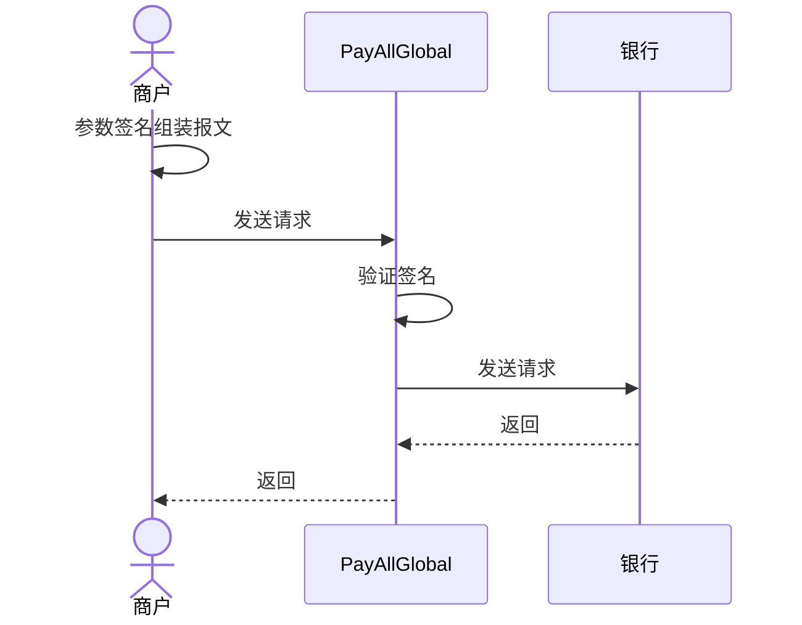

# Open API interface documentation
* 更新时间：2022-01-16 21:31:02
## 修订记录

| 版本	 | 日期	  | 说明 |
| :-----| :----  | :---- |
|2.0.0 |2022/01/14 | 文档初始化|
|2.0.0 |2022/01/16 | 增加签名说明|
|2.0.0 |2022/01/20 | 增加支付、交易查询、退款、撤销 |
|2.0.0 |2022/08/22 | 增加转账代付、转账结果查询 |
|2.0.0 |2022/08/30 | 增加下载交易报表|
|2.0.0 |2024/01/11 | 增加3D预授权，3D预授权撤销，3D预授权完成接口|

## 介绍

### 概述

本文档为PayAllGlobal跨境支付的API接口文档,商户服务器和PayAllGlobal跨境支付服务器进行交互。供商户/平台服务方的系统分析人员、系统设计人员、技术开发人员及测试人员使用。
本文档分别从交互流程、通讯协议、安全控制、交易接口、注意事项等角度详细介绍了PayAllGlobal跨境支付API接口的工作方式和开发过程， 可以帮助开发人员快速接入支付系统， 同时也可以作为后续接口参数以及参数类型的速查手册。
### 版权声明
文档版权归PayAllGlobal所有。作为本系统的最终用户，可以拥有该份文档的使用权，但未征得本公司的书面批准，不得向第三方借阅、出让、出版该文档。

### 提交地址
所有接口统一提交地址:

* 测试环境

| 环境	      | 请求地址                                                                                  | 
|:---------|:--------------------------------------------------------------------------------------|
| 支付       | https://mpgwdev.payallglobal.com/mp-gateway/api/mapi/v1/payments/open/api/pay            |
| 3D预授权    | https://mpgwdev.payallglobal.com/mp-gateway/api/mapi/v1/payments/open/api/preAuth        |
| 3D预授权撤销 | https://mpgwdev.payallglobal.com/mp-gateway/api/mapi/v1/payments/open/api/preAuthVoid        |
| 3D预授权完成 | https://mpgwdev.payallglobal.com/mp-gateway/api/mapi/v1/payments/open/api/preAuthComplete        |
| 交易查询     | https://mpgwdev.payallglobal.com/mp-gateway/api/mapi/v1/payments/open/api/query          |
| 退款       | https://mpgwdev.payallglobal.com/mp-gateway/api/mapi/v1/payments/open/api/refund         |
| 撤销       | https://mpgwdev.payallglobal.com/mp-gateway/api/mapi/v1/payments/open/api/voids          |
| 转账       | https://mpgwdev.payallglobal.com/mp-gateway/api/mapi/v1/payments/open/api/transfer       |
| 转账查询     | https://mpgwdev.payallglobal.com/mp-gateway/api/mapi/v1/payments/open/api/transfer/query |
| 下载交易报表   | https://mpgwdev.payallglobal.com/mp-gateway/api/mapi/v1/payments/open/api/download       |
| 获取openid | https://mpgwdev.payallglobal.com/mp-gateway/api/mapi/v1/weChatPay/jsapi/authorize        |

* 生产环境

| 环境	      | 请求地址                                                                               | 
|:---------|:-----------------------------------------------------------------------------------|
| 支付       | https://mpgw.payallglobal.com/mp-gateway/api/mapi/v1/payments/open/api/pay            |
| 3D预授权    | https://mpgw.payallglobal.com/mp-gateway/api/mapi/v1/payments/open/api/preAuth        |
| 3D预授权撤销 | https://mpgw.payallglobal.com/mp-gateway/api/mapi/v1/payments/open/api/preAuthVoid        |
| 3D预授权完成 | https://mpgw.payallglobal.com/mp-gateway/api/mapi/v1/payments/open/api/preAuthComplete        |
| 交易查询     | https://mpgw.payallglobal.com/mp-gateway/api/mapi/v1/payments/open/api/query          |
| 退款       | https://mpgw.payallglobal.com/mp-gateway/api/mapi/v1/payments/open/api/refund         |
| 撤销       | https://mpgw.payallglobal.com/mp-gateway/api/mapi/v1/payments/open/api/voids          |
| 转账       | https://mpgw.payallglobal.com/mp-gateway/api/mapi/v1/payments/open/api/transfer       |
| 转账查询     | https://mpgw.payallglobal.com/mp-gateway/api/mapi/v1/payments/open/api/transfer/query |
| 下载交易报表   | https://mpgw.payallglobal.com/mp-gateway/api/mapi/v1/payments/open/api/download       |
| 获取openid | https://mpgw.payallglobal.com/mp-gateway/api/mapi/v1/weChatPay/jsapi/authorize        |

## 技术方案
### 交互流程

1) 商户在发起请求之前，首先根据接口报文说明进行签名，再向PayAllGlobal发送交易请求。
2) 商户在收到PayAllGlobal响应或通知后，需要对报文进行验签，保证报文没有被篡改。
      `Note:` 商户与PayAllGlobal所有报文交互，都应遵循上述交互流程。
## 交互模式
### 后台交易类
1)	商户根据PayAllGlobal提供的接口规则，组装交易的请求报文以及根据交易请求数据通过程序生成签名字符串。把组装完成的请求报文，通过HTTP GET或者POST方式传给PayAllGlobal。
2)	PayAllGlobal收到请求报文后，对报文进行验签和参数校验。
3)	如果验签和参数校验未通过，PayAllGlobal会直接将验签、参数校验结果同步返回给商户。
      `Note：`这种情况不会有异步通知，也无法进行交易查询；所以务必要联调测试通过。
4)	如果验签和参数校验都通过，PayAllGlobal会对交易请求进行一些列业务处理。
5)	同步响应数据： PayAllGlobal同步返回该笔交易的处理结果和响应数据，其中响应数据在同一HTTP连接的response报文的body体中以JSON格式返回。商户同步接收到HTTP响应后，获取返回的JSON报文；根据具体的报文格式解析出具体的响应数据，进行商户端的业务处理逻辑。
      Note：若交易同步返回状态为“PENDING”，商户应等待PayAllGlobal异步结果再进行业务处理。
6)	异步结果通知： PayAllGlobal在同步返回结果后，会继续进行异步逻辑处理，如收到银行渠道的异步支付结果通知等。PayAllGlobal在服务异步处理后，通过商户请求报文中传入的notifyUrl，通过HTTP POST方式通知商户最终处理结果。
7)	异步结果通知处理：商户在成功收到异步处理结果后，需要在响应体按照通知应答格式进行响应，表示商户已经成功收到异步结果通知，否则PayAllGlobal会在随后的一段时间内，以递增的时间间隔重发，最多重发8次，间隔为1m,4m,10m,15m,60m(共计1小时30分钟)。
8)	如果商户长时间未收到交易结果，商户应向PayAllGlobal发起QUERY交易查询，查询交易结果。

### 后台查询类
1) 商户根据PayAllGlobal提供的接口规则，组装交易的请求报文以及根据交易请求数据通过程序生成签名字符串。把组装完成的请求报文，通过HTTP GET或者POST方式传给PayAllGlobal。
2) PayAllGlobal收到请求报文后，对报文进行一系列校验后对这笔交易进行处理。
3) 同步响应数据： PayAllGlobal同步返回该笔交易的处理结果和响应数据，其中响应数据在同一HTTP连接的response报文的body体中以JSON格式返回。商户同步接收到HTTP响应后，获取返回的JSON报文；根据具体的报文格式解析出具体的响应数据，进行商户端的业务处理逻辑。
      `Note：`如果商户长时间未收到查询结果，可以重复发起交易。
## 通讯方式

所有的基础通讯采用http/https协议进行网络通讯，以POST方式为主，同时支持GET方式（推荐使用POST方式，使用GET方式容易造成请求参数长度超限、敏感参数暴露）。
## 密钥生成参考

[在线工具](https://miniu.alipay.com/keytool/create)

## 安全控制
### 安全方案
* 为了保证数据在传输过程中的安全性和完整性，商户端需要对数据进行加签、验签、加解密处理。签名方式目前支持RSA签名方式,具体要求如下：
+ SignType = RSA，表示选择RSA证书签名方案，商户使用商户证书私钥对请求报文进行签名，PayAllGlobal使用商户证书公钥进行去验签。
### 签名和验签
1) 参与签名的字段：请求的JSON报文。
2) 签名算法：本支付系统的签名算法采用SHA256withRSA算法。
